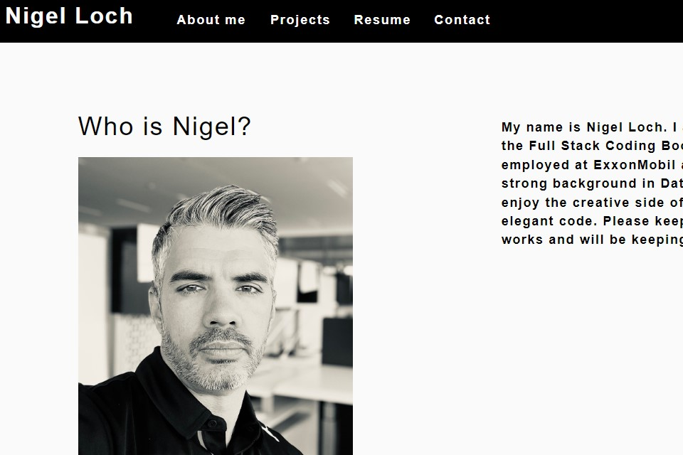

#  Portfolio

##  Description

I have created an updated version of my original portfolio using React. The portfolio site contains an About Me section, a Project list, my Resume, and a Contact form.

##  Table of Contents
* [Installation](#installation)
* [Usage](#usage)
* [Tests](#tests)
* [License](#license)
* [Contributors/Resources](#contributors)
* [Questions](#questions)

##  Installation

No installation necessary

##  Usage

Anyone interested in viewing my Portfolio can do so here: <https://nigelloch.github.io/portfolio/>

##  Tests

No testing was performed

##  License

MIT

##  Contributors/Resources

Nigel Loch

##  Questions

If there are any questions about this project, please contact me at <nigelloch@gmail.com>. Thank you!

To see more of my projects, please visit my GitHub Repo at <https://github.com/nigelloch?tab=repositories>

  
